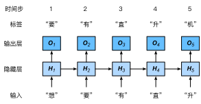

Task02：文本预处理、语言模型、循环神经网络基础
===========================================


# 1 文本预处理

文本是一类序列数据，一篇文章可以看作是字符或单词的序列，本节将介绍文本数据的常见预处理步骤，预处理通常包括四个步骤：
* 读入文本
* 分词
* 建立字典，将每个词映射到一个唯一的索引（index）
* 将文本从词的序列转换为索引的序列，方便输入模型

## 1.1 文本读取
我们用一部英文小说，即H. G. Well的Time Machine，作为示例，展示文本预处理的具体过程。
``` python
import collections
import re

def read_time_machine():
    with open('/home/kesci/input/timemachine7163/timemachine.txt', 'r') as f:
        lines = [re.sub('[^a-z]+', ' ', line.strip().lower()) for line in f]
    return lines


lines = read_time_machine()
print('# sentences %d' % len(lines))
``` 
输出：
```
# sentences 3221
```
## 1.2 分词
我们对每个句子进行分词，也就是将一个句子划分成若干个词（token），转换为一个词的序列。
``` python
def tokenize(sentences, token='word'):
    """Split sentences into word or char tokens"""
    if token == 'word':
        return [sentence.split(' ') for sentence in sentences]
    elif token == 'char':
        return [list(sentence) for sentence in sentences]
    else:
        print('ERROR: unkown token type '+token)

tokens = tokenize(lines)
tokens[0:2]
``` 
输出：
```
[['the', 'time', 'machine', 'by', 'h', 'g', 'wells', ''], ['']]
```

### 建立字典
为了方便模型处理，我们需要将字符串转换为数字。因此我们需要先构建一个字典（vocabulary），将每个词映射到一个唯一的索引编号。
``` python
class Vocab(object):
    def __init__(self, tokens, min_freq=0, use_special_tokens=False):
        counter = count_corpus(tokens)  # : 
        self.token_freqs = list(counter.items())
        self.idx_to_token = []
        if use_special_tokens:
            # padding, begin of sentence, end of sentence, unknown
            self.pad, self.bos, self.eos, self.unk = (0, 1, 2, 3)
            self.idx_to_token += ['', '', '', '']
        else:
            self.unk = 0
            self.idx_to_token += ['']
        self.idx_to_token += [token for token, freq in self.token_freqs
                        if freq >= min_freq and token not in self.idx_to_token]
        self.token_to_idx = dict()
        for idx, token in enumerate(self.idx_to_token):
            self.token_to_idx[token] = idx

    def __len__(self):
        return len(self.idx_to_token)

    def __getitem__(self, tokens):
        if not isinstance(tokens, (list, tuple)):
            return self.token_to_idx.get(tokens, self.unk)
        return [self.__getitem__(token) for token in tokens]

    def to_tokens(self, indices):
        if not isinstance(indices, (list, tuple)):
            return self.idx_to_token[indices]
        return [self.idx_to_token[index] for index in indices]

def count_corpus(sentences):
    tokens = [tk for st in sentences for tk in st]
    return collections.Counter(tokens)  # 返回一个字典，记录每个词的出现次数
``` 
我们看一个例子，这里我们尝试用Time Machine作为语料构建字典
``` python
vocab = Vocab(tokens)
print(list(vocab.token_to_idx.items())[0:10])
``` 
输出：
```
[('', 0), ('the', 1), ('time', 2), ('machine', 3), ('by', 4), ('h', 5), ('g', 6), ('wells', 7), ('i', 8), ('traveller', 9)]
```


# 2 语言模型

语言模型（language model）是自然语言处理的重要技术。自然语言处理中最常见的数据是文本数据。我们可以把一段自然语言文本看作一段离散的时间序列。假设一段长度为$T$的文本中的词依次为$w_1, w_2, \ldots, w_T$，那么在离散的时间序列中，$w_t$（$1 \leq t \leq T$）可看作在时间步（time step）$t$的输出或标签。给定一个长度为$T$的词的序列$w_1, w_2, \ldots, w_T$，语言模型将计算该序列的概率：

$$P(w_1, w_2, \ldots, w_T).$$


语言模型可用于提升语音识别和机器翻译的性能。例如，在语音识别中，给定一段“厨房里食油用完了”的语音，有可能会输出“厨房里食油用完了”和“厨房里石油用完了”这两个读音完全一样的文本序列。如果语言模型判断出前者的概率大于后者的概率，我们就可以根据相同读音的语音输出“厨房里食油用完了”的文本序列。在机器翻译中，如果对英文“you go first”逐词翻译成中文的话，可能得到“你走先”“你先走”等排列方式的文本序列。如果语言模型判断出“你先走”的概率大于其他排列方式的文本序列的概率，我们就可以把“you go first”翻译成“你先走”。


## 2.1 语言模型的计算


既然语言模型很有用，那该如何计算它呢？假设序列$w_1, w_2, \ldots, w_T$中的每个词是依次生成的，我们有

$$P(w_1, w_2, \ldots, w_T) = \prod_{t=1}^T P(w_t \mid w_1, \ldots, w_{t-1}).$$

例如，一段含有4个词的文本序列的概率

$$P(w_1, w_2, w_3, w_4) =  P(w_1) P(w_2 \mid w_1) P(w_3 \mid w_1, w_2) P(w_4 \mid w_1, w_2, w_3).$$

为了计算语言模型，我们需要计算词的概率，以及一个词在给定前几个词的情况下的条件概率，即语言模型参数。设训练数据集为一个大型文本语料库，如维基百科的所有条目。词的概率可以通过该词在训练数据集中的相对词频来计算。例如，$P(w_1)$可以计算为$w_1$在训练数据集中的词频（词出现的次数）与训练数据集的总词数之比。因此，根据条件概率定义，一个词在给定前几个词的情况下的条件概率也可以通过训练数据集中的相对词频计算。例如，$P(w_2 \mid w_1)$可以计算为$w_1, w_2$两词相邻的频率与$w_1$词频的比值，因为该比值即$P(w_1, w_2)$与$P(w_1)$之比；而$P(w_3 \mid w_1, w_2)$同理可以计算为$w_1$、$w_2$和$w_3$三词相邻的频率与$w_1$和$w_2$两词相邻的频率的比值。以此类推。


## 2.2 $n$元语法

当序列长度增加时，计算和存储多个词共同出现的概率的复杂度会呈指数级增加。$n$元语法通过马尔可夫假设（虽然并不一定成立）简化了语言模型的计算。这里的马尔可夫假设是指一个词的出现只与前面$n$个词相关，即$n$阶马尔可夫链（Markov chain of order $n$）。如果$n=1$，那么有$P(w_3 \mid w_1, w_2) = P(w_3 \mid w_2)$。如果基于$n-1$阶马尔可夫链，我们可以将语言模型改写为

$$P(w_1, w_2, \ldots, w_T) \approx \prod_{t=1}^T P(w_t \mid w_{t-(n-1)}, \ldots, w_{t-1}) .$$


以上也叫$n$元语法（$n$-grams）。它是基于$n - 1$阶马尔可夫链的概率语言模型。当$n$分别为1、2和3时，我们将其分别称作一元语法（unigram）、二元语法（bigram）和三元语法（trigram）。例如，长度为4的序列$w_1, w_2, w_3, w_4$在一元语法、二元语法和三元语法中的概率分别为

$$
\begin{aligned}
P(w_1, w_2, w_3, w_4) &=  P(w_1) P(w_2) P(w_3) P(w_4) ,
\end{aligned}
$$

$$
\begin{aligned}
P(w_1, w_2, w_3, w_4) &=  P(w_1) P(w_2 \mid w_1) P(w_3 \mid w_2) P(w_4 \mid w_3) ,
\end{aligned}
$$

$$
\begin{aligned}
P(w_1, w_2, w_3, w_4) &=  P(w_1) P(w_2 \mid w_1) P(w_3 \mid w_1, w_2) P(w_4 \mid w_2, w_3) .
\end{aligned}
$$

当$n$较小时，$n$元语法往往并不准确。例如，在一元语法中，由三个词组成的句子“你走先”和“你先走”的概率是一样的。然而，当$n$较大时，$n$元语法需要计算并存储大量的词频和多词相邻频率。

## 小结

* 语言模型是自然语言处理的重要技术。
* $N$元语法是基于$n-1$阶马尔可夫链的概率语言模型，其中$n$权衡了计算复杂度和模型准确性。

-----------
> [原书传送门](https://zh.d2l.ai/chapter_recurrent-neural-networks/lang-model.html)

-----------------------------------------------------------------------------------
# 3 循环神经网络

上一节介绍的$n$元语法中，时间步$t$的词$w_t$基于前面所有词的条件概率只考虑了最近时间步的$n-1$个词。如果要考虑比$t-(n-1)$更早时间步的词对$w_t$的可能影响，我们需要增大$n$。但这样模型参数的数量将随之呈指数级增长。

本节将介绍循环神经网络。它并非刚性地记忆所有固定长度的序列，而是通过隐藏状态来存储之前时间步的信息。首先我们回忆一下前面介绍过的多层感知机，然后描述如何添加隐藏状态来将它变成循环神经网络。


## 3.1 不含隐藏状态的神经网络

让我们考虑一个含单隐藏层的多层感知机。给定样本数为$n$、输入个数（特征数或特征向量维度）为$d$的小批量数据样本$\boldsymbol{X} \in \mathbb{R}^{n \times d}$。设隐藏层的激活函数为$\phi$，那么隐藏层的输出$\boldsymbol{H} \in \mathbb{R}^{n \times h}$计算为

$$\boldsymbol{H} = \phi(\boldsymbol{X} \boldsymbol{W}_{xh} + \boldsymbol{b}_h),$$

其中隐藏层权重参数$\boldsymbol{W}_{xh} \in \mathbb{R}^{d \times h}$，隐藏层偏差参数 $\boldsymbol{b}_h \in \mathbb{R}^{1 \times h}$，$h$为隐藏单元个数。上式相加的两项形状不同，因此将按照广播机制相加。把隐藏变量$\boldsymbol{H}$作为输出层的输入，且设输出个数为$q$（如分类问题中的类别数），输出层的输出为

$$\boldsymbol{O} = \boldsymbol{H} \boldsymbol{W}_{hq} + \boldsymbol{b}_q,$$

其中输出变量$\boldsymbol{O} \in \mathbb{R}^{n \times q}$, 输出层权重参数$\boldsymbol{W}_{hq} \in \mathbb{R}^{h \times q}$, 输出层偏差参数$\boldsymbol{b}_q \in \mathbb{R}^{1 \times q}$。如果是分类问题，我们可以使用$\text{softmax}(\boldsymbol{O})$来计算输出类别的概率分布。


## 3.2 含隐藏状态的循环神经网络

现在我们考虑输入数据存在时间相关性的情况。假设$\boldsymbol{X}_ t \in \mathbb{R}^{n \times d}$是序列中时间步$t$的小批量输入，$\boldsymbol{H}_ t  \in \mathbb{R}^{n \times h}$是该时间步的隐藏变量。与多层感知机不同的是，这里我们保存上一时间步的隐藏变量$\boldsymbol{H}_ {t-1}$，并引入一个新的权重参数$\boldsymbol{W}_ {hh} \in \mathbb{R}^{h \times h}$，该参数用来描述在当前时间步如何使用上一时间步的隐藏变量。具体来说，时间步$t$的隐藏变量的计算由当前时间步的输入和上一时间步的隐藏变量共同决定：

$$\boldsymbol{H}_ t = \phi(\boldsymbol{X}_ t \boldsymbol{W}_ {xh} + \boldsymbol{H}_ {t-1} \boldsymbol{W}_ {hh}  + \boldsymbol{b}_ h).$$

与多层感知机相比，我们在这里添加了$\boldsymbol{H}_ {t-1} \boldsymbol{W}_ {hh}$一项。由上式中相邻时间步的隐藏变量$\boldsymbol{H}_ t$和$\boldsymbol{H}_ {t-1}$之间的关系可知，这里的隐藏变量能够捕捉截至当前时间步的序列的历史信息，就像是神经网络当前时间步的状态或记忆一样。因此，该隐藏变量也称为隐藏状态。由于隐藏状态在当前时间步的定义使用了上一时间步的隐藏状态，上式的计算是循环的。使用循环计算的网络即循环神经网络（recurrent neural network）。

循环神经网络有很多种不同的构造方法。含上式所定义的隐藏状态的循环神经网络是极为常见的一种。若无特别说明，本章中的循环神经网络均基于上式中隐藏状态的循环计算。在时间步$t$，输出层的输出和多层感知机中的计算类似：

$$\boldsymbol{O}_ t = \boldsymbol{H}_ t \boldsymbol{W}_ {hq} + \boldsymbol{b}_ q.$$

循环神经网络的参数包括隐藏层的权重$\boldsymbol{W}_ {xh} \in \mathbb{R}^{d \times h}$、$\boldsymbol{W}_ {hh} \in \mathbb{R}^{h \times h}$和偏差 $\boldsymbol{b}_ h \in \mathbb{R}^{1 \times h}$，以及输出层的权重$\boldsymbol{W}_ {hq} \in \mathbb{R}^{h \times q}$和偏差$\boldsymbol{b}_ q \in \mathbb{R}^{1 \times q}$。值得一提的是，即便在不同时间步，循环神经网络也始终使用这些模型参数。因此，循环神经网络模型参数的数量不随时间步的增加而增长。

图3.1展示了循环神经网络在3个相邻时间步的计算逻辑。在时间步$t$，隐藏状态的计算可以看成是将输入$\boldsymbol{X}_ t$和前一时间步隐藏状态$\boldsymbol{H}_ {t-1}$连结后输入一个激活函数为$\phi$的全连接层。该全连接层的输出就是当前时间步的隐藏状态$\boldsymbol{H}_ t$，且模型参数为$\boldsymbol{W}_ {xh}$与$\boldsymbol{W}_ {hh}$的连结，偏差为$\boldsymbol{b}_ h$。当前时间步$t$的隐藏状态$\boldsymbol{H}_ t$将参与下一个时间步$t+1$的隐藏状态$\boldsymbol{H}_ {t+1}$的计算，并输入到当前时间步的全连接输出层。

<div align=center>

</div>
<div align=center>图3.1 含隐藏状态的循环神经网络</div>

我们刚刚提到，隐藏状态中$\boldsymbol{X}_ t \boldsymbol{W}_ {xh} + \boldsymbol{H}_ {t-1} \boldsymbol{W}_ {hh}$的计算等价于$\boldsymbol{X}_ t$与$\boldsymbol{H}_ {t-1}$连结后的矩阵乘以$\boldsymbol{W}_ {xh}$与$\boldsymbol{W}_ {hh}$连结后的矩阵。接下来，我们用一个具体的例子来验证这一点。首先，我们构造矩阵`X`、`W_xh`、`H`和`W_hh`，它们的形状分别为(3, 1)、(1, 4)、(3, 4)和(4, 4)。将`X`与`W_xh`、`H`与`W_hh`分别相乘，再把两个乘法运算的结果相加，得到形状为(3, 4)的矩阵。

``` python
import torch

X, W_xh = torch.randn(3, 1), torch.randn(1, 4)
H, W_hh = torch.randn(3, 4), torch.randn(4, 4)
torch.matmul(X, W_xh) + torch.matmul(H, W_hh)
```
输出：
```
tensor([[ 5.2633, -3.2288,  0.6037, -1.3321],
        [ 9.4012, -6.7830,  1.0630, -0.1809],
        [ 7.0355, -2.2361,  0.7469, -3.4667]])
```

将矩阵`X`和`H`按列（维度1）连结，连结后的矩阵形状为(3, 5)。可见，连结后矩阵在维度1的长度为矩阵`X`和`H`在维度1的长度之和（$1+4$）。然后，将矩阵`W_xh`和`W_hh`按行（维度0）连结，连结后的矩阵形状为(5, 4)。最后将两个连结后的矩阵相乘，得到与上面代码输出相同的形状为(3, 4)的矩阵。

``` python
torch.matmul(torch.cat((X, H), dim=1), torch.cat((W_xh, W_hh), dim=0))
```
输出：
```
tensor([[ 5.2633, -3.2288,  0.6037, -1.3321],
        [ 9.4012, -6.7830,  1.0630, -0.1809],
        [ 7.0355, -2.2361,  0.7469, -3.4667]])
```

## 3.3 应用：基于字符级循环神经网络的语言模型

最后我们介绍如何应用循环神经网络来构建一个语言模型。设小批量中样本数为1，文本序列为“想”“要”“有”“直”“升”“机”。图6.2演示了如何使用循环神经网络基于当前和过去的字符来预测下一个字符。在训练时，我们对每个时间步的输出层输出使用softmax运算，然后使用交叉熵损失函数来计算它与标签的误差。在图3.2中，由于隐藏层中隐藏状态的循环计算，时间步3的输出$\boldsymbol{O}_3$取决于文本序列“想”“要”“有”。 由于训练数据中该序列的下一个词为“直”，时间步3的损失将取决于该时间步基于序列“想”“要”“有”生成下一个词的概率分布与该时间步的标签“直”。

<div align=center>

</div>
<div align=center>图3.2 基于字符级循环神经网络的语言模型。</div>


因为每个输入词是一个字符，因此这个模型被称为字符级循环神经网络（character-level recurrent neural network）。因为不同字符的个数远小于不同词的个数（对于英文尤其如此），所以字符级循环神经网络的计算通常更加简单。在接下来的几节里，我们将介绍它的具体实现。


## 小结

* 使用循环计算的网络即循环神经网络。
* 循环神经网络的隐藏状态可以捕捉截至当前时间步的序列的历史信息。
* 循环神经网络模型参数的数量不随时间步的增加而增长。
* 可以基于字符级循环神经网络来创建语言模型。

-----------
> [原书传送门](https://zh.d2l.ai/chapter_recurrent-neural-networks/rnn.html)


