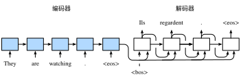

Task04：机器翻译及相关技术；注意力机制与Seq2seq模型；Transformer
============================================================
# 1 机器翻译及相关技术

机器翻译（MT）：将一段文本从一种语言自动翻译为另一种语言，用神经网络解决这个问题通常称为神经机器翻译（NMT）。 主要特征：输出是单词序列而不是单个单词。 输出序列的长度可能与源序列的长度不同。   

## 1.1 Encoder-Decoder

Encoder-Decoder 是 NLP 领域里的一种模型框架。它被广泛用于机器翻译、语音识别等任务。我们将详细介绍 Encoder-Decoder、Seq2Seq 以及他们的升级方案Attention。    
Encoder-Decoder 模型主要是 NLP 领域里的概念。它并不特值某种具体的算法，而是一类算法的统称。Encoder-Decoder 算是一个通用的框架，在这个框架下可以使用不同的算法来解决不同的任务。    
Encoder-Decoder 这个框架很好的诠释了机器学习的核心思路：
> 将现实问题转化为数学问题，通过求解数学问题，从而解决现实问题。  
Encoder 又称作编码器。它的作用就是「将现实问题转化为数学问题」     
Decoder 又称作解码器，他的作用是「求解数学问题，并转化为现实世界的解决方案」    

> encoder：输入到隐藏状态   
> decoder：隐藏状态到输出  

图1.1 Encoder-Decoder

-----------
>[一文看懂 NLP 里的模型框架 Encoder-Decoder 和 Seq2Seq](https://segmentfault.com/a/1190000020843265)

## 1.2 Sequence to Sequence模型
只要是符合上面的框架，都可以统称为 Encoder-Decoder 模型。说到 Encoder-Decoder 模型就经常提到一个名词—— Seq2Seq。Seq2Seq（是 Sequence-to-sequence 的缩写），就如字面意思，输入一个序列，输出另一个序列。这种结构最重要的地方在于输入序列和输出序列的长度是可变的。

我们已经在前两节中表征并变换了不定长的输入序列。但在自然语言处理的很多应用中，输入和输出都可以是不定长序列。以机器翻译为例，输入可以是一段不定长的英语文本序列，输出可以是一段不定长的法语文本序列，例如

> 英语输入：“They”、“are”、“watching”、“.”

> 法语输出：“Ils”、“regardent”、“.”

当输入和输出都是不定长序列时，我们可以使用编码器—解码器（encoder-decoder）或者seq2seq模型。这两个模型本质上都用到了两个循环神经网络，分别叫做编码器和解码器。编码器用来分析输入序列，解码器用来生成输出序列。

图1.2描述了使用编码器—解码器将上述英语句子翻译成法语句子的一种方法。在训练数据集中，我们可以在每个句子后附上特殊符号“&lt;eos&gt;”（end of sequence）以表示序列的终止。编码器每个时间步的输入依次为英语句子中的单词、标点和特殊符号“&lt;eos&gt;”。图1.2中使用了编码器在最终时间步的隐藏状态作为输入句子的表征或编码信息。解码器在各个时间步中使用输入句子的编码信息和上个时间步的输出以及隐藏状态作为输入。我们希望解码器在各个时间步能正确依次输出翻译后的法语单词、标点和特殊符号"&lt;eos&gt;"。需要注意的是，解码器在最初时间步的输入用到了一个表示序列开始的特殊符号"&lt;bos&gt;"（beginning of sequence）。

图1.2 使用编码器—解码器将句子由英语翻译成法语。编码器和解码器分别为循环神经网络

接下来，我们分别介绍编码器和解码器的定义。

### 1.2.1 编码器

编码器的作用是把一个不定长的输入序列变换成一个定长的背景变量$\boldsymbol{c}$，并在该背景变量中编码输入序列信息。常用的编码器是循环神经网络。

让我们考虑批量大小为1的时序数据样本。假设输入序列是$x_1,\ldots,x_T$，例如$x_i$是输入句子中的第$i$个词。在时间步$t$，循环神经网络将输入$x_t$的特征向量$\boldsymbol{x}_ t$和上个时间步的隐藏状态$\boldsymbol{h}_ {t-1}$变换为当前时间步的隐藏状态$\boldsymbol{h}_ t$。我们可以用函数$f$表达循环神经网络隐藏层的变换：

$$
\boldsymbol{h}_ t = f(\boldsymbol{x}_ t, \boldsymbol{h}_ {t-1}).
$$

接下来，编码器通过自定义函数$q$将各个时间步的隐藏状态变换为背景变量

$$
\boldsymbol{c} =  q(\boldsymbol{h}_ 1, \ldots, \boldsymbol{h}_ T).
$$

例如，当选择$q(\boldsymbol{h}_ 1, \ldots, \boldsymbol{h}_ T) = \boldsymbol{h}_ T$时，背景变量是输入序列最终时间步的隐藏状态$\boldsymbol{h}_T$。

以上描述的编码器是一个单向的循环神经网络，每个时间步的隐藏状态只取决于该时间步及之前的输入子序列。我们也可以使用双向循环神经网络构造编码器。在这种情况下，编码器每个时间步的隐藏状态同时取决于该时间步之前和之后的子序列（包括当前时间步的输入），并编码了整个序列的信息。

### 1.2.2 解码器

刚刚已经介绍，编码器输出的背景变量$\boldsymbol{c}$编码了整个输入序列$x_1, \ldots, x_T$的信息。给定训练样本中的输出序列$y_1, y_2, \ldots, y_{T'}$，对每个时间步$t'$（符号与输入序列或编码器的时间步$t$有区别），解码器输出$y_{t'}$的条件概率将基于之前的输出序列$y_1,\ldots,y_{t'-1}$和背景变量$\boldsymbol{c}$，即$P(y_{t'} \mid y_1, \ldots, y_{t'-1}, \boldsymbol{c})$。

为此，我们可以使用另一个循环神经网络作为解码器。在输出序列的时间步$t^\prime$，解码器将上一时间步的输出$y_{t^\prime-1}$以及背景变量$\boldsymbol{c}$作为输入，并将它们与上一时间步的隐藏状态$\boldsymbol{s}_ {t^\prime-1}$变换为当前时间步的隐藏状态$\boldsymbol{s}_{t^\prime}$。因此，我们可以用函数$g$表达解码器隐藏层的变换：

$$
\boldsymbol{s}_ {t^\prime} = g(y_{t^\prime-1}, \boldsymbol{c}, \boldsymbol{s}_ {t^\prime-1}).
$$

有了解码器的隐藏状态后，我们可以使用自定义的输出层和softmax运算来计算$P(y_ {t^\prime} \mid y_ 1, \ldots, y_ {t^\prime-1}, \boldsymbol{c})$，例如，基于当前时间步的解码器隐藏状态 $\boldsymbol{s}_ {t^\prime}$、上一时间步的输出$y_ {t^\prime-1}$以及背景变量$\boldsymbol{c}$来计算当前时间步输出$y_{t^\prime}$的概率分布。

## 1.2.3 训练模型

根据最大似然估计，我们可以最大化输出序列基于输入序列的条件概率

$$
\begin{aligned}
P(y_1, \ldots, y_{T'} \mid x_1, \ldots, x_T)
&= \prod_{t'=1}^{T'} P(y_{t'} \mid y_1, \ldots, y_{t'-1}, x_1, \ldots, x_T)\\
&= \prod_{t'=1}^{T'} P(y_{t'} \mid y_1, \ldots, y_{t'-1}, \boldsymbol{c}),
\end{aligned}
$$

并得到该输出序列的损失

$$
-\log P(y_1, \ldots, y_{T'} \mid x_1, \ldots, x_T) = -\sum_{t'=1}^{T'} \log P(y_{t'} \mid y_1, \ldots, y_{t'-1}, \boldsymbol{c}),
$$

在模型训练中，所有输出序列损失的均值通常作为需要最小化的损失函数。在图10.8所描述的模型预测中，我们需要将解码器在上一个时间步的输出作为当前时间步的输入。与此不同，在训练中我们也可以将标签序列（训练集的真实输出序列）在上一个时间步的标签作为解码器在当前时间步的输入。这叫作强制教学（teacher forcing）。

## 小结

* 编码器-解码器（seq2seq）可以输入并输出不定长的序列。
* 编码器—解码器使用了两个循环神经网络。
* 在编码器—解码器的训练中，可以采用强制教学。
-----------
>[原书传送门](https://zh.d2l.ai/chapter_natural-language-processing/seq2seq.html)

## 1.3 束搜索 Beam Search

前面介绍了如何训练输入和输出均为不定长序列的编码器—解码器。本节我们介绍如何使用编码器—解码器来预测不定长的序列。

上一节里已经提到，在准备训练数据集时，我们通常会在样本的输入序列和输出序列后面分别附上一个特殊符号"&lt;eos&gt;"表示序列的终止。我们在接下来的讨论中也将沿用上一节的全部数学符号。为了便于讨论，假设解码器的输出是一段文本序列。设输出文本词典$\mathcal{Y}$（包含特殊符号"&lt;eos&gt;"）的大小为$\left|\mathcal{Y}\right|$，输出序列的最大长度为$T'$。所有可能的输出序列一共有$\mathcal{O}(\left|\mathcal{Y}\right|^{T'})$种。这些输出序列中所有特殊符号"&lt;eos&gt;"后面的子序列将被舍弃。

### 1.3.1 贪婪搜索

让我们先来看一个简单的解决方案：贪婪搜索（greedy search）。对于输出序列任一时间步$t'$，我们从$|\mathcal{Y}|$个词中搜索出条件概率最大的词

$$
y _ { t ^ { \prime } } = \underset { y \in \mathcal { Y } } { \operatorname { argmax } } P \left( y | y _ { 1 } , \ldots , y _ { t ^ { \prime } - 1 } , c \right)
$$

作为输出。一旦搜索出"&lt;eos&gt;"符号，或者输出序列长度已经达到了最大长度$T'$，便完成输出。

我们在描述解码器时提到，基于输入序列生成输出序列的条件概率是$\prod_{t'=1}^{T'} P(y_{t'} \mid y_1, \ldots, y_{t'-1}, \boldsymbol{c})$。我们将该条件概率最大的输出序列称为最优输出序列。而贪婪搜索的主要问题是不能保证得到最优输出序列。

下面来看一个例子。假设输出词典里面有“A”“B”“C”和“&lt;eos&gt;”这4个词。图1.3中每个时间步下的4个数字分别代表了该时间步生成“A”“B”“C”和“&lt;eos&gt;”这4个词的条件概率。在每个时间步，贪婪搜索选取条件概率最大的词。因此，图1.3中将生成输出序列“A”“B”“C”“&lt;eos&gt;”。该输出序列的条件概率是$0.5\times0.4\times0.4\times0.6 = 0.048$。

图1.3 在每个时间步，贪婪搜索选取条件概率最大的词

接下来，观察图1.4演示的例子。与图1.3中不同，图1.4在时间步2中选取了条件概率第二大的词“C”。由于时间步3所基于的时间步1和2的输出子序列由图10.9中的“A”“B”变为了图1.4中的“A”“C”，图1.4中时间步3生成各个词的条件概率发生了变化。我们选取条件概率最大的词“B”。此时时间步4所基于的前3个时间步的输出子序列为“A”“C”“B”，与图1.3中的“A”“B”“C”不同。因此，图1.4中时间步4生成各个词的条件概率也与图1.3中的不同。我们发现，此时的输出序列“A”“C”“B”“&lt;eos&gt;”的条件概率是$0.5\times0.3\times0.6\times0.6=0.054$，大于贪婪搜索得到的输出序列的条件概率。因此，贪婪搜索得到的输出序列“A”“B”“C”“&lt;eos&gt;”并非最优输出序列。

图1.4 在时间步2选取条件概率第二大的词“C”

### 1.3.2 穷举搜索

如果目标是得到最优输出序列，我们可以考虑穷举搜索（exhaustive search）：穷举所有可能的输出序列，输出条件概率最大的序列。

虽然穷举搜索可以得到最优输出序列，但它的计算开销$\mathcal{O}(\left|\mathcal{Y}\right|^{T'})$很容易过大。例如，当$|\mathcal{Y}|=10000$且$T'=10$时，我们将评估$10000^{10} = 10^{40}$个序列：这几乎不可能完成。而贪婪搜索的计算开销是$\mathcal{O}(\left|\mathcal{Y}\right|T')$，通常显著小于穷举搜索的计算开销。例如，当$|\mathcal{Y}|=10000$且$T'=10$时，我们只需评估$10000\times10=10^5$个序列。

### 1.3.3 束搜索

束搜索（beam search）是对贪婪搜索的一个改进算法。它有一个束宽（beam size）超参数。我们将它设为$k$。在时间步1时，选取当前时间步条件概率最大的$k$个词，分别组成$k$个候选输出序列的首词。在之后的每个时间步，基于上个时间步的$k$个候选输出序列，从$k\left|\mathcal{Y}\right|$个可能的输出序列中选取条件概率最大的$k$个，作为该时间步的候选输出序列。最终，我们从各个时间步的候选输出序列中筛选出包含特殊符号“&lt;eos&gt;”的序列，并将它们中所有特殊符号“&lt;eos&gt;”后面的子序列舍弃，得到最终候选输出序列的集合。

图1.5 束搜索的过程。束宽为2，输出序列最大长度为3。候选输出序列有A、C、AB、CE、ABD和CED

图1.5通过一个例子演示了束搜索的过程。假设输出序列的词典中只包含5个元素，即$\mathcal{Y} = \{A, B, C, D, E\}$，且其中一个为特殊符号“&lt;eos&gt;”。设束搜索的束宽等于2，输出序列最大长度为3。在输出序列的时间步1时，假设条件概率$P(y_1 \mid \boldsymbol{c})$最大的2个词为$A$和$C$。我们在时间步2时将对所有的$y_2 \in \mathcal{Y}$都分别计算$P(y_2 \mid A, \boldsymbol{c})$和$P(y_2 \mid C, \boldsymbol{c})$，并从计算出的10个条件概率中取最大的2个，假设为$P(B \mid A, \boldsymbol{c})$和$P(E \mid C, \boldsymbol{c})$。那么，我们在时间步3时将对所有的$y_3 \in \mathcal{Y}$都分别计算$P(y_3 \mid A, B, \boldsymbol{c})$和$P(y_3 \mid C, E, \boldsymbol{c})$，并从计算出的10个条件概率中取最大的2个，假设为$P(D \mid A, B, \boldsymbol{c})$和$P(D \mid C, E, \boldsymbol{c})$。如此一来，我们得到6个候选输出序列：（1）$A$；（2）$C$；（3）$A$、$B$；（4）$C$、$E$；（5）$A$、$B$、$D$和（6）$C$、$E$、$D$。接下来，我们将根据这6个序列得出最终候选输出序列的集合。

在最终候选输出序列的集合中，我们取以下分数最高的序列作为输出序列：

$$ \frac{1}{L^\alpha} \log P(y_1, \ldots, y_{L}) = \frac{1}{L^\alpha} \sum_{t'=1}^L \log P(y_{t'} \mid y_1, \ldots, y_{t'-1}, \boldsymbol{c}),$$

其中$L$为最终候选序列长度，$\alpha$一般可选为0.75。分母上的$L^\alpha$是为了惩罚较长序列在以上分数中较多的对数相加项。分析可知，束搜索的计算开销为$\mathcal{O}(k\left|\mathcal{Y}\right|T')$。这介于贪婪搜索和穷举搜索的计算开销之间。此外，贪婪搜索可看作是束宽为1的束搜索。束搜索通过灵活的束宽$k$来权衡计算开销和搜索质量。

## 小结

* 预测不定长序列的方法包括贪婪搜索、穷举搜索和束搜索。
* 束搜索通过灵活的束宽来权衡计算开销和搜索质量。
-----------
>[原书传送门](https://zh.d2l.ai/chapter_natural-language-processing/beam-search.html)

# 2 注意力机制与Seq2seq模型

在（编码器—解码器（seq2seq））里，解码器在各个时间步依赖相同的背景变量来获取输入序列信息。当编码器为循环神经网络时，背景变量来自它最终时间步的隐藏状态。

现在，让我们再次思考上一节提到的翻译例子：输入为英语序列“They”“are”“watching”“.”，输出为法语序列“Ils”“regardent”“.”。不难想到，解码器在生成输出序列中的每一个词时可能只需利用输入序列某一部分的信息。例如，在输出序列的时间步1，解码器可以主要依赖“They”“are”的信息来生成“Ils”，在时间步2则主要使用来自“watching”的编码信息生成“regardent”，最后在时间步3则直接映射句号“.”。这看上去就像是在解码器的每一时间步对输入序列中不同时间步的表征或编码信息分配不同的注意力一样。这也是注意力机制的由来。

仍然以循环神经网络为例，注意力机制通过对编码器所有时间步的隐藏状态做加权平均来得到背景变量。解码器在每一时间步调整这些权重，即注意力权重，从而能够在不同时间步分别关注输入序列中的不同部分并编码进相应时间步的背景变量。本节我们将讨论注意力机制是怎么工作的。

在（编码器—解码器（seq2seq））里我们区分了输入序列或编码器的索引$t$与输出序列或解码器的索引$t'$。该节中，解码器在时间步$t'$的隐藏状态$\boldsymbol{s}_ {t'} = g(\boldsymbol{y}_ {t'-1}, \boldsymbol{c}, \boldsymbol{s}_ {t'-1})$，其中$\boldsymbol{y}_ {t'-1}$是上一时间步$t'-1$的输出$y_{t'-1}$的表征，且任一时间步$t'$使用相同的背景变量$\boldsymbol{c}$。但在注意力机制中，解码器的每一时间步将使用可变的背景变量。记$\boldsymbol{c}_ {t'}$是解码器在时间步$t'$的背景变量，那么解码器在该时间步的隐藏状态可以改写为

$$\boldsymbol{s}_ {t'} = g(\boldsymbol{y}_ {t'-1}, \boldsymbol{c}_ {t'}, \boldsymbol{s}_ {t'-1}).$$

这里的关键是如何计算背景变量$\boldsymbol{c}_ {t'}$和如何利用它来更新隐藏状态$\boldsymbol{s}_ {t'}$。下面将分别描述这两个关键点。

## 2.1 计算背景变量

我们先描述第一个关键点，即计算背景变量。图2.1描绘了注意力机制如何为解码器在时间步2计算背景变量。首先，函数$a$根据解码器在时间步1的隐藏状态和编码器在各个时间步的隐藏状态计算softmax运算的输入。softmax运算输出概率分布并对编码器各个时间步的隐藏状态做加权平均，从而得到背景变量。

图2.1 编码器—解码器上的注意力机制

具体来说，令编码器在时间步$t$的隐藏状态为$\boldsymbol{h}_t$，且总时间步数为$T$。那么解码器在时间步$t'$的背景变量为所有编码器隐藏状态的加权平均：

$$
\boldsymbol{c}_ {t'} = \sum_{t=1}^T \alpha_{t' t} \boldsymbol{h}_ t,
$$

其中给定$t'$时，权重$\alpha_{t' t}$在$t=1,\ldots,T$的值是一个概率分布。为了得到概率分布，我们可以使用softmax运算:

$$
\alpha_{t' t} = \frac{\exp(e_{t' t})}{ \sum_{k=1}^T \exp(e_{t' k}) },\quad t=1,\ldots,T.
$$

现在，我们需要定义如何计算上式中softmax运算的输入$e_{t' t}$。由于$e_{t' t}$同时取决于解码器的时间步$t'$和编码器的时间步$t$，我们不妨以解码器在时间步$t'-1$的隐藏状态$\boldsymbol{s}_ {t' - 1}$与编码器在时间步$t$的隐藏状态$\boldsymbol{h}_ t$为输入，并通过函数$a$计算$e_{t' t}$：

$$
e_{t' t} = a(\boldsymbol{s}_ {t' - 1}, \boldsymbol{h}_t).
$$

这里函数$a$有多种选择，如果两个输入向量长度相同，一个简单的选择是计算它们的内积$a(\boldsymbol{s}, \boldsymbol{h})=\boldsymbol{s}^\top \boldsymbol{h}$。而最早提出注意力机制的论文则将输入连结后通过含单隐藏层的多层感知机变换：

$$
a(\boldsymbol{s}, \boldsymbol{h}) = \boldsymbol{v}^\top \tanh(\boldsymbol{W}_ s \boldsymbol{s} + \boldsymbol{W}_ h \boldsymbol{h}),
$$

其中$\boldsymbol{v}$、$\boldsymbol{W}_ s$、$\boldsymbol{W}_ h$都是可以学习的模型参数。

## 2.2 更新隐藏状态

现在我们描述第二个关键点，即更新隐藏状态。以门控循环单元为例，在解码器中我们可以对（门控循环单元（GRU））中门控循环单元的设计稍作修改，从而变换上一时间步$t'-1$的输出$\boldsymbol{y}_ {t'-1}$、隐藏状态$\boldsymbol{s}_ {t' - 1}$和当前时间步$t'$的含注意力机制的背景变量$\boldsymbol{c}_ {t'}$。解码器在时间步$t'$的隐藏状态为

$$\boldsymbol{s}_ {t'} = \boldsymbol{z}_ {t'} \odot \boldsymbol{s}_ {t'-1}  + (1 - \boldsymbol{z}_ {t'}) \odot \tilde{\boldsymbol{s}}_ {t'},$$

其中的重置门、更新门和候选隐藏状态分别为

$$
\begin{aligned}
\boldsymbol{r}_ {t'} &= \sigma(\boldsymbol{W}_ {yr} \boldsymbol{y}_ {t'-1} + \boldsymbol{W}_ {sr} \boldsymbol{s}_ {t' - 1} + \boldsymbol{W}_  {cr} \boldsymbol{c}_ {t'} + \boldsymbol{b}_ r),\newline
\boldsymbol{z}_ {t'} &= \sigma(\boldsymbol{W}_ {yz} \boldsymbol{y}_ {t'-1} + \boldsymbol{W}_ {sz} \boldsymbol{s}_ {t' - 1} + \boldsymbol{W}_ {cz} \boldsymbol{c}_ {t'} + \boldsymbol{b}_ z),\newline
\tilde{\boldsymbol{s}}_ {t'} &= \text{tanh}(\boldsymbol{W}_ {ys} \boldsymbol{y}_ {t'-1} + \boldsymbol{W}_ {ss} (\boldsymbol{s}_ {t' - 1} \odot \boldsymbol{r}_ {t'}) + \boldsymbol{W}_ {cs} \boldsymbol{c}_ {t'} + \boldsymbol{b}_ s),
\end{aligned}
$$

其中含下标的$\boldsymbol{W}$和$\boldsymbol{b}$分别为门控循环单元的权重参数和偏差参数。

## 2.3 发展

本质上，注意力机制能够为表征中较有价值的部分分配较多的计算资源。这个有趣的想法自提出后得到了快速发展，特别是启发了依靠注意力机制来编码输入序列并解码出输出序列的变换器（Transformer）模型的设计。变换器抛弃了卷积神经网络和循环神经网络的架构。它在计算效率上比基于循环神经网络的编码器—解码器模型通常更具明显优势。含注意力机制的变换器的编码结构在后来的BERT预训练模型中得以应用并令后者大放异彩：微调后的模型在多达11项自然语言处理任务中取得了当时最先进的结果。不久后，同样是基于变换器设计的GPT-2模型于新收集的语料数据集预训练后，在7个未参与训练的语言模型数据集上均取得了当时最先进的结果。除了自然语言处理领域，注意力机制还被广泛用于图像分类、自动图像描述、唇语解读以及语音识别。

## 小结

* 可以在解码器的每个时间步使用不同的背景变量，并对输入序列中不同时间步编码的信息分配不同的注意力。
* 广义上，注意力机制的输入包括查询项以及一一对应的键项和值项。
* 注意力机制可以采用更为高效的矢量化计算。

-----------
> 注[原书传送门](https://zh.d2l.ai/chapter_natural-language-processing/attention.html)

# 3 Transformer
对于主流的神经网络架构如卷积神经网络（CNNs）和循环神经网络（RNNs），有如下特征：

- CNNs 易于并行化，却不适合捕捉变长序列内的依赖关系。
- RNNs 适合捕捉长距离变长序列的依赖，但是却难以实现并行化处理序列。

为了整合CNN和RNN的优势，[\[Vaswani et al., 2017\]](https://d2l.ai/chapter_references/zreferences.html#vaswani-shazeer-parmar-ea-2017) 创新性地使用注意力机制设计了Transformer模型。该模型利用attention机制实现了并行化捕捉序列依赖，并且同时处理序列的每个位置的tokens，上述优势使得Transformer模型在性能优异的同时大大减少了训练时间。

图3.1展示了Transformer模型的架构，与seq2seq模型相似，Transformer同样基于编码器-解码器架构，其区别主要在于以下三点：    
1. Transformer blocks：将seq2seq模型重的循环网络替换为了Transformer Blocks，该模块包含一个多头注意力层（Multi-head Attention Layers）以及两个position-wise feed-forward networks（FFN）。对于解码器来说，另一个多头注意力层被用于接受编码器的隐藏状态。    
2. Add and norm：多头注意力层和前馈网络的输出被送到两个“add and norm”层进行处理，该层包含残差结构以及层归一化。    
3. Position encoding：由于自注意力层并没有区分元素的顺序，所以一个位置编码层被用于向序列元素里添加位置信息。    

$$
图 3.1\ Transformer 架构.
$$

## 3.1 多头注意力层

在我们讨论多头注意力层之前，先来迅速理解以下自注意力（self-attention）的结构。自注意力模型是一个正规的注意力模型，序列的每一个元素对应的key，value，query是完全一致的。如图3.2 自注意力输出了一个与输入长度相同的表征序列，与循环神经网络相比，自注意力对每个元素输出的计算是并行的，所以我们可以高效的实现这个模块。

	

$$
图3.2\ 自注意力结构
$$

多头注意力层包含$h$个并行的自注意力层，每一个这种层被成为一个head。对每个头来说，在进行注意力计算之前，我们会将query、key和value用三个现行层进行映射，这$h$个注意力头的输出将会被拼接之后输入最后一个线性层进行整合。

$$
图3.3\ 多头注意力
$$

假设query，key和value的维度分别是$d_q$、$d_k$和$d_v$。那么对于每一个头$i=1,\ldots,h$，我们可以训练相应的模型权重$W_q^{(i)} \in \mathbb{R}^{p_q\times d_q}$、$W_k^{(i)} \in \mathbb{R}^{p_k\times d_k}$和$W_v^{(i)} \in \mathbb{R}^{p_v\times d_v}$，以得到每个头的输出：

$$
o^{(i)} = attention(W_q^{(i)}q, W_k^{(i)}k, W_v^{(i)}v)
$$

这里的attention可以是任意的attention function，比如前一节介绍的dot-product attention以及MLP attention。之后我们将所有head对应的输出拼接起来，送入最后一个线性层进行整合，这个层的权重可以表示为$W_o\in \mathbb{R}^{d_0 \times hp_v}$

$$
o = W_o[o^{(1)}, \ldots, o^{(h)}]
$$

## 3.2 基于位置的前馈网络FFN

Transformer 模块另一个非常重要的部分就是基于位置的前馈网络（FFN），它接受一个形状为（batch_size，seq_length, feature_size）的三维张量。Position-wise FFN由两个全连接层组成，他们作用在最后一维上。因为序列的每个位置的状态都会被单独地更新，所以我们称他为position-wise，这等效于一个1x1的卷积。

与多头注意力层相似，FFN层同样只会对最后一维的大小进行改变；除此之外，对于两个完全相同的输入，FFN层的输出也将相等。

## 3.3 相加归一化层Add and Norm

除了上面两个模块之外，Transformer还有一个重要的相加归一化层，它可以平滑地整合输入和其他层的输出，因此我们在每个多头注意力层和FFN层后面都添加一个含残差连接的Layer Norm层。这里 Layer Norm 与Batch Norm很相似，唯一的区别在于Batch Norm是对于batch size这个维度进行计算均值和方差的，而Layer Norm则是对最后一维进行计算。层归一化可以防止层内的数值变化过大，从而有利于加快训练速度并且提高泛化性能。 

[(ref)](https://zhuanlan.zhihu.com/p/54530247)

### 3.4位置编码

与循环神经网络不同，无论是多头注意力网络还是前馈神经网络都是独立地对每个位置的元素进行更新，这种特性帮助我们实现了高效的并行，却丢失了重要的序列顺序的信息。为了更好的捕捉序列信息，Transformer模型引入了位置编码去保持输入序列元素的位置。

假设输入序列的嵌入表示 $X\in \mathbb{R}^{l\times d}$, 序列长度为$l$嵌入向量维度为$d$，则其位置编码为$P \in \mathbb{R}^{l\times d}$ ，输出的向量就是二者相加 $X + P$。

位置编码是一个二维的矩阵，i对应着序列中的顺序，j对应其embedding vector内部的维度索引。我们可以通过以下等式计算位置编码：

$$
P_{i,2j} = sin(i/10000^{2j/d})
$$

$$
P_{i,2j+1} = cos(i/10000^{2j/d})
$$

$$
for\ i=0,\ldots, l-1\ and\ j=0,\ldots,\lfloor (d-1)/2 \rfloor
$$

$$
图3.4\ 位置编码
$$

