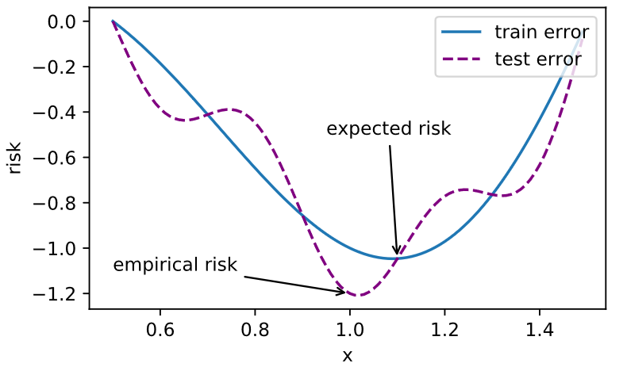

Task06：批量归一化；残差网络；凸优化；梯度下降
==========================================

# 1 批量归一化（BN, BatchNormalization）

本节我们介绍批量归一化（batch normalization）层，它能让较深的神经网络的训练变得更加容易。在实战Kaggle比赛：预测房价里，我们对输入数据做了标准化处理：处理后的任意一个特征在数据集中所有样本上的均值为0、标准差为1。标准化处理输入数据使各个特征的分布相近：这往往更容易训练出有效的模型。

通常来说，数据标准化预处理对于浅层模型就足够有效了。随着模型训练的进行，当每层中参数更新时，靠近输出层的输出较难出现剧烈变化。但对深层神经网络来说，即使输入数据已做标准化，训练中模型参数的更新依然很容易造成靠近输出层输出的剧烈变化。这种计算数值的不稳定性通常令我们难以训练出有效的深度模型。

批量归一化的提出正是为了应对深度模型训练的挑战。在模型训练时，批量归一化利用小批量上的均值和标准差，不断调整神经网络中间输出，从而使整个神经网络在各层的中间输出的数值更稳定。**批量归一化和残差网络为训练和设计深度模型提供了两类重要思路**。

#### 对输入的标准化（浅层模型）
> 处理后的任意一个特征在数据集中所有样本上的均值为0、标准差为1。  
> 标准化处理输入数据使各个特征的分布相近

#### 批量归一化（深度模型）
> 利用小批量上的均值和标准差，不断调整神经网络中间输出，从而使整个神经网络在各层的中间输出的数值更稳定。
 
## 1.1 对全连接层做批量归一化
位置：全连接层中的仿射变换和激活函数之间。  
**全连接：**  
$$
\boldsymbol{x} = \boldsymbol{W\boldsymbol{u} + \boldsymbol{b}} \\
 output =\phi(\boldsymbol{x})
 $$   


**批量归一化：**
$$ 
output=\phi(\text{BN}(\boldsymbol{x}))$$


$$
\boldsymbol{y}^{(i)} = \text{BN}(\boldsymbol{x}^{(i)})
$$


$$
\boldsymbol{\mu}_ \mathcal{B} \leftarrow \frac{1}{m}\sum_ {i = 1}^{m} \boldsymbol{x}^{(i)},
$$ 
$$
\boldsymbol{\sigma}_ \mathcal{B}^2 \leftarrow \frac{1}{m} \sum_ {i=1}^{m}(\boldsymbol{x}^{(i)} - \boldsymbol{\mu}_ \mathcal{B})^2,
$$


$$
\hat{\boldsymbol{x}}^{(i)} \leftarrow \frac{\boldsymbol{x}^{(i)} - \boldsymbol{\mu}_ \mathcal{B}}{\sqrt{\boldsymbol{\sigma}_ \mathcal{B}^2 + \epsilon}},
$$

这⾥ϵ > 0是个很小的常数，保证分母大于0


$$
{\boldsymbol{y}}^{(i)} \leftarrow \boldsymbol{\gamma} \odot
\hat{\boldsymbol{x}}^{(i)} + \boldsymbol{\beta}.
$$

至此，我们得到了$\boldsymbol{x}^{(i)}$的批量归一化的输出$\boldsymbol{y}^{(i)}$。
值得注意的是，可学习的拉伸和偏移参数保留了不对$\hat{\boldsymbol{x}}^{(i)}$做批量归一化的可能：此时只需学出$\boldsymbol{\gamma} = \sqrt{\boldsymbol{\sigma}_ \mathcal{B}^2 + \epsilon}$和$\boldsymbol{\beta} = \boldsymbol{\mu}_ \mathcal{B}$。我们可以对此这样理解：如果批量归一化无益，理论上，学出的模型可以不使用批量归一化。

比如网络中间某一层学习到特征数据本身就分布在S型激活函数的两侧，你强制把它给我归一化处理、标准差也限制在了1，把数据变换成分布于s函数的中间部分，这样就相当于我这一层网络所学习到的特征分布被你搞坏了，这可怎么办？于是通过变换重构，引入可学习参数：拉伸参数γ和偏移参数β，这就是算法关键之处。当$\boldsymbol{\gamma} = \sqrt{\boldsymbol{\sigma}_ \mathcal{B}^2 + \epsilon}$和$\boldsymbol{\beta} = \boldsymbol{\mu}_ \mathcal{B}$时，是可以恢复出原始的某一层所学到的特征的。因此我们引入了这个可学习重构参数γ、β，让我们的网络可以学习恢复出原始网络所要学习的特征分布。

## 1.2 对卷积层做批量归⼀化
位置：卷积计算之后、应用激活函数之前。  
如果卷积计算输出多个通道，我们需要对这些通道的输出分别做批量归一化，且每个通道都拥有独立的拉伸和偏移参数。
计算：对单通道，batchsize=m,卷积计算输出=pxq
对该通道中m×p×q个元素同时做批量归一化,使用相同的均值和方差。

## 1.3 预测时的批量归⼀化
使用批量归一化训练时，我们可以将批量大小设得大一点，从而使批量内样本的均值和方差的计算都较为准确。将训练好的模型用于预测时，我们希望模型对于任意输入都有确定的输出。因此，单个样本的输出不应取决于批量归一化所需要的随机小批量中的均值和方差。一种常用的方法是通过移动平均估算整个训练数据集的样本均值和方差，并在预测时使用它们得到确定的输出。可见，和丢弃层一样，批量归一化层在训练模式和预测模式下的计算结果也是不一样的。

训练：以batch为单位,对每个batch计算均值和方差。  
预测：用移动平均估算整个训练数据集的样本均值和方差。


## 小结

* 在模型训练时，批量归一化利用小批量上的均值和标准差，不断调整神经网络的中间输出，从而使整个神经网络在各层的中间输出的数值更稳定。
* 对全连接层和卷积层做批量归一化的方法稍有不同。
* 批量归一化层和丢弃层一样，在训练模式和预测模式的计算结果是不一样的。
* PyTorch提供了BatchNorm类方便使用。

-----------
> [原书传送门](https://zh.d2l.ai/chapter_convolutional-neural-networks/batch-norm.html)


# 2 残差网络

深度学习的问题：深度CNN网络达到一定深度后再一味地增加层数并不能带来进一步地分类性能提高，反而会招致网络收敛变得更慢，准确率也变得更差。
## 2.1 残差块（Residual Block）
恒等映射：  
左边：f(x)=x                                                  
右边：f(x)-x=0 （易于捕捉恒等映射的细微波动）

<div align=center>

</div>
<div align=center>图2.1 普通的网络结构（左）与加入残差连接的网络结构（右）</div>

ResNet沿用了VGG全$3\times 3$卷积层的设计。残差块里首先有2个有相同输出通道数的$3\times 3$卷积层。每个卷积层后接一个批量归一化层和ReLU激活函数。然后我们将输入跳过这两个卷积运算后直接加在最后的ReLU激活函数前。这样的设计要求两个卷积层的输出与输入形状一样，从而可以相加。如果想改变通道数，就需要引入一个额外的$1\times 1$卷积层来将输入变换成需要的形状后再做相加运算。在残差块中，输⼊可通过跨层的数据线路更快地向前传播。

## 2.2 ResNet模型

ResNet的前两层跟之前介绍的GoogLeNet中的一样：在输出通道数为64、步幅为2的$7\times 7$卷积层后接步幅为2的$3\times 3$的最大池化层。不同之处在于ResNet每个卷积层后增加的批量归一化层。

``` python
net = nn.Sequential(
        nn.Conv2d(1, 64, kernel_size=7, stride=2, padding=3),
        nn.BatchNorm2d(64), 
        nn.ReLU(),
        nn.MaxPool2d(kernel_size=3, stride=2, padding=1))
```

GoogLeNet在后面接了4个由Inception块组成的模块。ResNet则使用4个由残差块组成的模块，每个模块使用若干个同样输出通道数的残差块。第一个模块的通道数同输入通道数一致。由于之前已经使用了步幅为2的最大池化层，所以无须减小高和宽。之后的每个模块在第一个残差块里将上一个模块的通道数翻倍，并将高和宽减半。

### 小结

* 残差块通过跨层的数据通道从而能够训练出有效的深度神经网络。
* ResNet深刻影响了后来的深度神经网络的设计。

-----------
>  [原书传送门](https://zh.d2l.ai/chapter_convolutional-neural-networks/googlenet.html)

## 2.3 稠密连接网络（DenseNet）
ResNet中的跨层连接设计引申出了数个后续工作。这里我们介绍其中的一个：稠密连接网络（DenseNet）。 它与ResNet的主要区别如图2.2所示。

<div align=center>

</div>
<div align=center>图2.2 ResNet（左）与DenseNet（右）在跨层连接上的主要区别：使用相加和使用连结</div>

图2.2中将部分前后相邻的运算抽象为模块$A$和模块$B$。与ResNet的主要区别在于，DenseNet里模块$B$的输出不是像ResNet那样和模块$A$的输出相加，而是在通道维上连结。这样模块$A$的输出可以直接传入模块$B$后面的层。在这个设计里，模块$A$直接跟模块$B$后面的所有层连接在了一起。这也是它被称为“稠密连接”的原因。

DenseNet的主要构建模块是稠密块（dense block）和过渡层（transition layer）。前者定义了输入和输出是如何连结的，后者则用来控制通道数，使之不过大。


### 小结

* 在跨层连接上，不同于ResNet中将输入与输出相加，DenseNet在通道维上连结输入与输出。
* DenseNet的主要构建模块是稠密块和过渡层。

-----------
> [原书传送门](https://zh.d2l.ai/chapter_convolutional-neural-networks/densenet.html)

# 3 凸优化

> 尽管优化方法可以最小化深度学习中的损失函数值，但本质上优化方法达到的目标与深度学习的目标并不相同。  
- 优化方法目标：训练集损失函数值   
- 深度学习目标：测试集损失函数值（泛化性）

## 3.1 优化在深度学习中的挑战
### 3.1.1 局部最小值

$$
f(x) = x\cos \pi x
$$
<div align=center>

</div>
<div align=center> 


### 3.1.2 鞍点
### 鞍点的定义 
一个不是局部最小值的驻点（一阶导数为0的点）称为鞍点。数学含义是： 目标函数在此点上的梯度（一阶导数）值为 0， 但从改点出发的一个方向是函数的极大值点，而在另一个方向是函数的极小值点。


### 3.1.3 梯度消失

## 3.2 凸性（Convexity）


## 3.3 凸函数与二阶导数
$f^{''}(x) \ge 0 \Longleftrightarrow f(x)$ 是凸函数

**必要性 ($\Leftarrow$):**

对于凸函数：

$$
\frac{1}{2} f(x+\epsilon)+\frac{1}{2} f(x-\epsilon) \geq f\left(\frac{x+\epsilon}{2}+\frac{x-\epsilon}{2}\right)=f(x)
$$

故:

$$
f^{\prime \prime}(x)=\lim _ {\varepsilon \rightarrow 0} \frac{\frac{f(x+\epsilon) - f(x)}{\epsilon}-\frac{f(x) - f(x-\epsilon)}{\epsilon}}{\epsilon}
$$


$$
f^{\prime \prime}(x)=\lim _ {\varepsilon \rightarrow 0} \frac{f(x+\epsilon)+f(x-\epsilon)-2 f(x)}{\epsilon^{2}} \geq 0
$$


**充分性 ($\Rightarrow$):**

令 $a < x < b$ 为 $f(x)$ 上的三个点，由拉格朗日中值定理:

$$
\begin{array}{l}{f(x)-f(a)=(x-a) f^{\prime}(\alpha) \text { for some } \alpha \in[a, x] \text { and }} \\ {f(b)-f(x)=(b-x) f^{\prime}(\beta) \text { for some } \beta \in[x, b]}\end{array}
$$


根据单调性，有 $f^{\prime}(\beta) \geq f^{\prime}(\alpha)$, 故:

$$
\begin{aligned} f(b)-f(a) &=f(b)-f(x)+f(x)-f(a) \\ &=(b-x) f^{\prime}(\beta)+(x-a) f^{\prime}(\alpha) \\ & \geq(b-a) f^{\prime}(\alpha) \end{aligned}
$$


# 4 梯度下降
