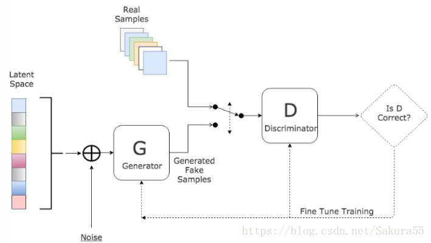
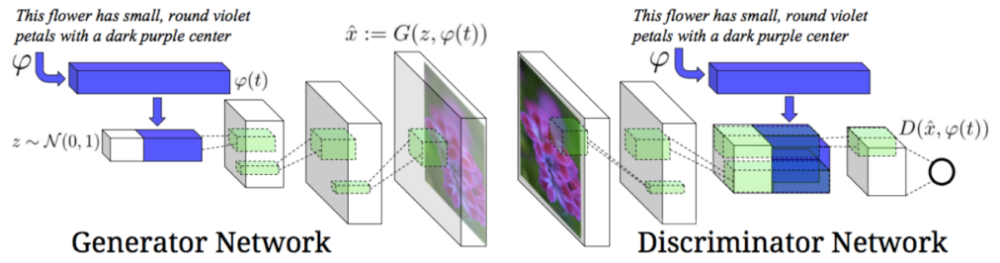

Task10：图像分类案例2；GAN；DCGAN
==================================

# 1 图像分类案例2
## 1.1 Kaggle上的狗品种识别（ImageNet Dogs） 
> 在本节中，我们将解决Kaggle竞赛中的犬种识别挑战，比赛的网址是https://www.kaggle.com/c/dog-breed-identification 在这项比赛中，我们尝试确定120种不同的狗。该比赛中使用的数据集实际上是著名的ImageNet数据集的子集。

## 1.2 整理数据集

我们可以从比赛网址上下载数据集，其目录结构为：

```
| Dog Breed Identification
    | train
    |   | 000bec180eb18c7604dcecc8fe0dba07.jpg
    |   | 00a338a92e4e7bf543340dc849230e75.jpg
    |   | ...
    | test
    |   | 00a3edd22dc7859c487a64777fc8d093.jpg
    |   | 00a6892e5c7f92c1f465e213fd904582.jpg
    |   | ...
    | labels.csv
    | sample_submission.csv
```

train和test目录下分别是训练集和测试集的图像，训练集包含10,222张图像，测试集包含10,357张图像，图像格式都是JPEG，每张图像的文件名是一个唯一的id。labels.csv包含训练集图像的标签，文件包含10,222行，每行包含两列，第一列是图像id，第二列是狗的类别。狗的类别一共有120种。

我们希望对数据进行整理，方便后续的读取，我们的主要目标是：

* 从训练集中划分出验证数据集，用于调整超参数。划分之后，数据集应该包含4个部分：划分后的训练集、划分后的验证集、完整训练集、完整测试集
* 对于4个部分，建立4个文件夹：train, valid, train_valid, test。在上述文件夹中，对每个类别都建立一个文件夹，在其中存放属于该类别的图像。前三个部分的标签已知，所以各有120个子文件夹，而测试集的标签未知，所以仅建立一个名为unknown的子文件夹，存放所有测试数据。

我们希望整理后的数据集目录结构为：
```
| train_valid_test
    | train
    |   | affenpinscher
    |   |   | 00ca18751837cd6a22813f8e221f7819.jpg
    |   |   | ...
    |   | afghan_hound
    |   |   | 0a4f1e17d720cdff35814651402b7cf4.jpg
    |   |   | ...
    |   | ...
    | valid
    |   | affenpinscher
    |   |   | 56af8255b46eb1fa5722f37729525405.jpg
    |   |   | ...
    |   | afghan_hound
    |   |   | 0df400016a7e7ab4abff824bf2743f02.jpg
    |   |   | ...
    |   | ...
    | train_valid
    |   | affenpinscher
    |   |   | 00ca18751837cd6a22813f8e221f7819.jpg
    |   |   | ...
    |   | afghan_hound
    |   |   | 0a4f1e17d720cdff35814651402b7cf4.jpg
    |   |   | ...
    |   | ...
    | test
    |   | unknown
    |   |   | 00a3edd22dc7859c487a64777fc8d093.jpg
    |   |   | ...
```

## 1.3 定义模型

这个比赛的数据属于ImageNet数据集的子集，我们使用微调的方法，选用在ImageNet完整数据集上预训练的模型来抽取图像特征，以作为自定义小规模输出网络的输入。

此处我们使用与训练的ResNet-34模型，直接复用预训练模型在输出层的输入，即抽取的特征，然后我们重新定义输出层，本次我们仅对重定义的输出层的参数进行训练，而对于用于抽取特征的部分，我们保留预训练模型的参数。

# 2 生成对抗网络(GAN, Generative Adversarial Networks)

GAN的全称是 Generative Adversarial Networks，中文名称是生成对抗网络。原始的GAN是一种无监督学习方法，巧妙的利用“博弈”的思想来学习生成式模型。

<div align=center>

</div>
<div align=center> </div>


## 2.1 GAN原理
GAN的主要灵感来源于博弈论中零和博弈的思想，应用到深度学习神经网络上来说，就是**通过生成网络G（Generator）和判别网络D（Discriminator）不断博弈，进而使G学习到数据的分布**，如果用到图片生成上，则训练完成后，G可以从一段随机数中生成逼真的图像。G， D的主要功能是：  
 ●  G是一个生成式网络，它接收一个随机的噪声z（随机数），通过这个噪声生成图像  
 ●  D是一个判别网络，判别一张图片是不是“真实的”。它的输入参数是x，x代表一张图片，输出D(x)代表x为真实图片的概率，如果为1，就代表100%是真实的图片，而输出为0，就代表不可能是真实的图片。
 
<div align=center>

</div>
<div align=center> </div>

训练过程中，生成网络G的目标就是尽量生成真实的图片去欺骗判别网络D。而D的目标就是尽量辨别出G生成的假图像和真实的图像。这样，G和D构成了一个动态的“博弈过程”，最终的平衡点即纳什均衡点。

## 2.2 损失函数

判别网络D的交叉熵损失函数为：

$$
 \min_D \{ - y \log D(\mathbf x) - (1-y)\log(1-D(\mathbf x)) \},
$$

生成式网络G的交叉熵损失函数为：
$$
 \max_G \{ - (1-y) \log(1-D(G(\mathbf z))) \} = \max_G \{ - \log(1-D(G(\mathbf z))) \}.
$$

出于存在梯度消失的问题，实际中使用的生成式网络G的交叉熵损失函数为：
$$
 \min_G \{ - y \log(D(G(\mathbf z))) \} = \min_G \{ - \log(D(G(\mathbf z))) \}, 
$$


总结来说，判别网络D和生成式网络G出于最小化和最大化之间的博弈：
$$
min_D max_G \{ -E_{x \sim \text{Data}} log D(\mathbf x) - E_{z \sim \text{Noise}} log(1 - D(G(\mathbf z))) \}.
$$

# 3 DCGAN
> DCGAN的特点
* 所有的pooling层使用步幅卷积(判别网络)和微步幅度卷积(生成网络)进行替换。     
* 在生成网络和判别网络上使用批处理规范化。      
* 对于更深的架构移除全连接隐藏层。      
* 在生成网络的所有层上使用RelU激活函数，除了输出层使用Tanh激活函数。     
* 在判别网络的所有层上使用LeakyReLU激活函数。     


